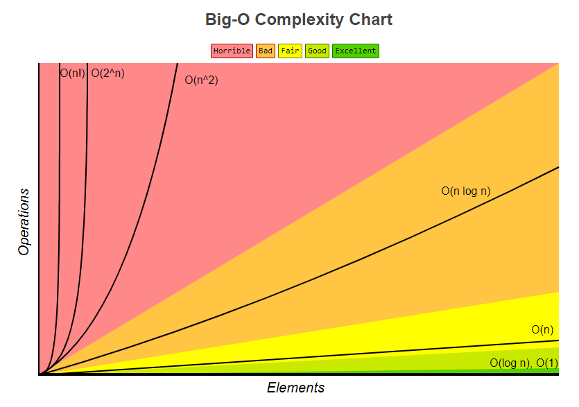
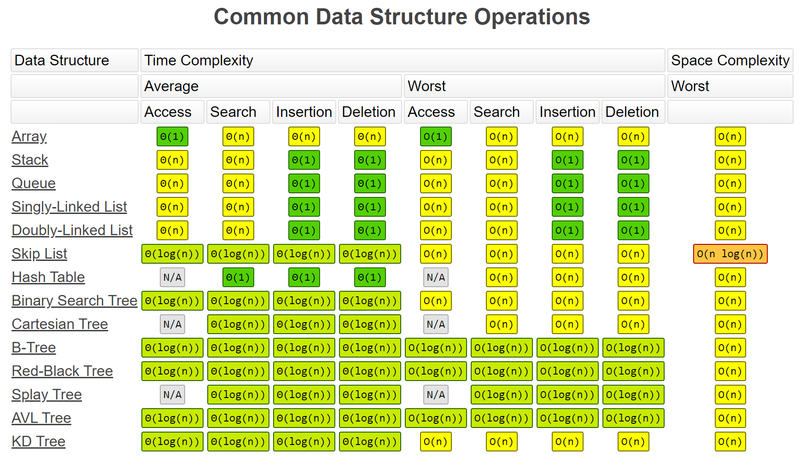
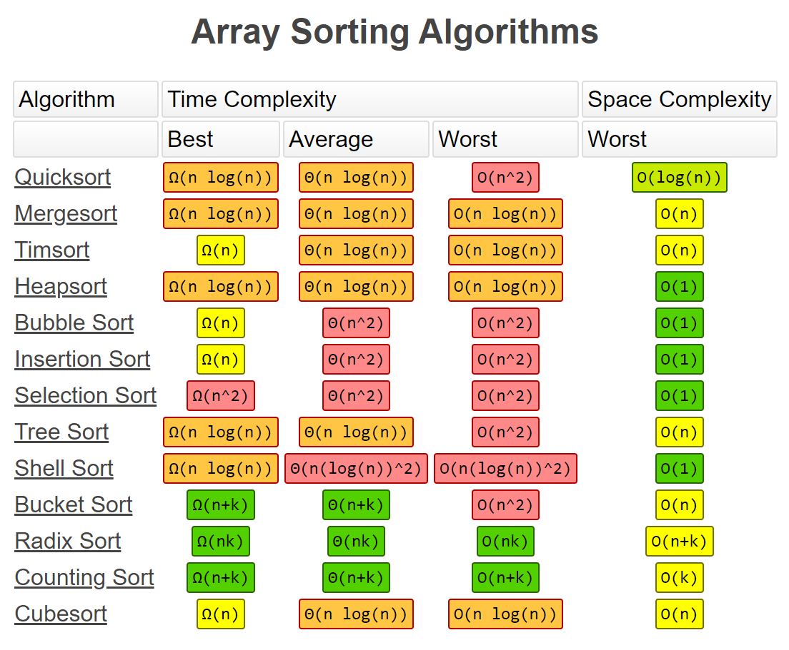

# leetcode

  
## General Questions
1. [Time and Space complexity](https://github.com/AASHISHAG/leetcode/blob/main/general-questions/time-space-complexity.txt)

## Binary Tree
1. [Count visible nodes](https://github.com/AASHISHAG/leetcode/blob/main/binary-tree/count-visible-nodes.py) - Microsoft

## String
1. [Largest alphabetic character](https://github.com/AASHISHAG/leetcode/blob/main/string/larget-alphabetic-character.py) - Microsoft
2. [Pattern recognition](https://github.com/AASHISHAG/leetcode/blob/main/string/pattern-recognition.py) - Microsoft
3. [Reverse words in a given string](https://github.com/AASHISHAG/leetcode/blob/main/string/reverse-words-in-a-given-string.py) - Geeks for Geeks

## Integers
1. [Maximum sum of two elements whose digit sum is equal](https://github.com/AASHISHAG/leetcode/blob/main/integers/maximum-sum.py) - Microsoft
2. [Maximum positive and negative number](https://github.com/AASHISHAG/leetcode/blob/main/integers/max-pos-neg.py) - Microsoft
